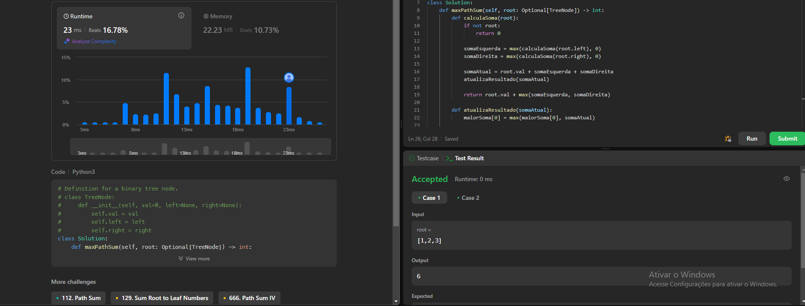
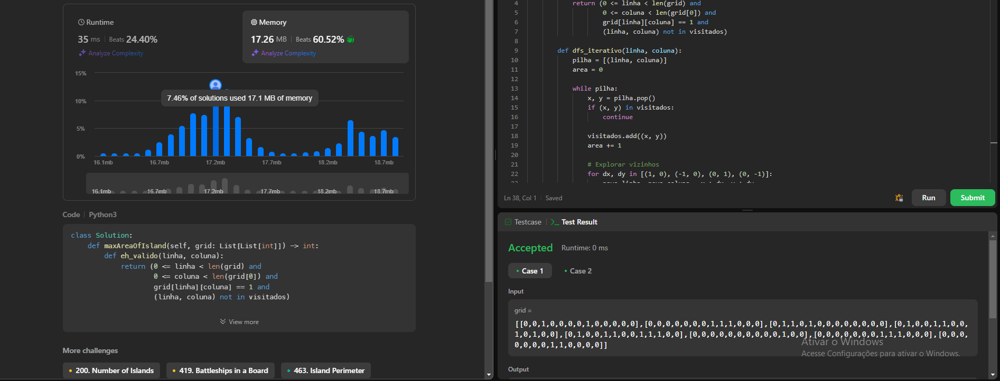
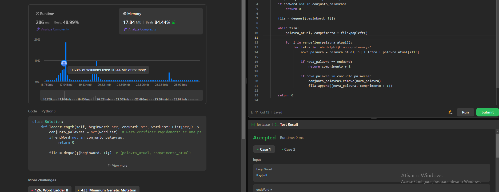

Temas:
 - Grafos1
# NomedoProjeto

**Conteúdo da Disciplina**: Grafos 1 

## Alunos
|Matrícula | Aluno |
| -- | -- |
| 19/0039116 |  Vinicius Alves Freitas Livramento |

## Questões 

|Questão | Nível |
| -- | -- |
| [695. Max Area of Island](https://leetcode.com/problems/max-area-of-island/description/?envType=problem-list-v2&envId=breadth-first-search)  |  Médio |
| [124. Binary Tree Maximum Path Sum](https://leetcode.com/problems/binary-tree-maximum-path-sum/description/?envType=problem-list-v2&envId=depth-first-search)  |  Difícil |
| [127. Word Ladder](https://leetcode.com/problems/word-ladder/description/?envType=problem-list-v2&envId=breadth-first-search&difficulty=HARD) |  Difícil |

## Sobre 
Realização de exercícios da plataforma de juiz eletrônico LeetCode

## Screenshots
### Problema 695

### Problema 124

## Problema 127

## Instalação 
**Linguagem**: Python 

